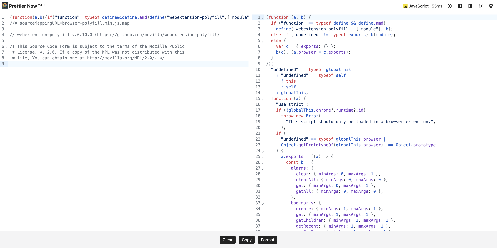
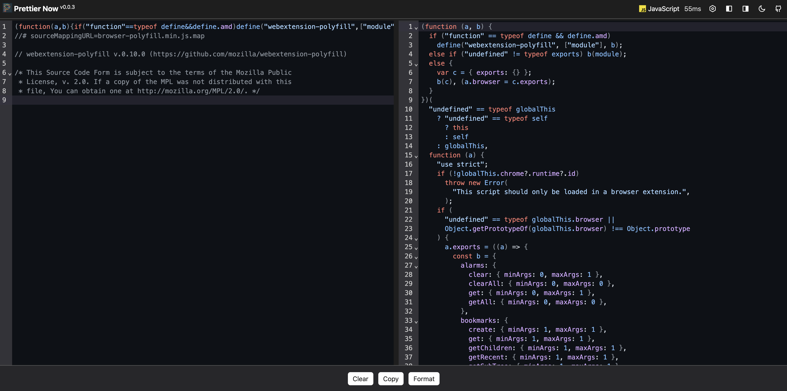

# prettier-now

> :hammer: Yet another [prettier](https://prettier.io) browser extension.

## Install

[link-chrome]: https://chromewebstore.google.com/detail/prettier-now/jdclalpfpcpojbhnkjebiepeeegmlhdf 'Version published on Chrome Web Store'
[link-firefox]: https://addons.mozilla.org/zh-CN/firefox/addon/prettier-now 'Version published to Mozilla Addons'

[][link-chrome] [][link-chrome] and other Chromium browsers

[][link-firefox] [][link-firefox]

## Features

- Format source code with customable options
- Drag and drop file to format

## Supported languages

### Built-in language plugins

- JavaScript
- TypeScript
- HTML
- Vue
- Angular
- CSS
- Less
- SCSS
- GraphQL
- JSON
- YAML
- Markdown

### Official language plugins

- XML (via [@prettier/plugin-xml](https://github.com/prettier/plugin-xml))
- PHP (via [@prettier/plugin-php](https://github.com/prettier/plugin-php))

### Community language plugins

- Java (via [prettier-plugin-java](https://github.com/jhipster/prettier-java))
- Svelte (via [prettier-plugin-svelte](https://github.com/sveltejs/prettier-plugin-svelte))

## Screenshots

## Prior Art

- UI design from [AST Explorer](https://ast.sxzz.moe) created by [sxzz](https://github.com/sxzz)
- Built on top of [WXT](https://wxt.dev), the next-gen web extension framework

## License

[MIT](./LICENSE) License © 2024 to PRESENT [ntnyq](https://github.com/ntnyq)
