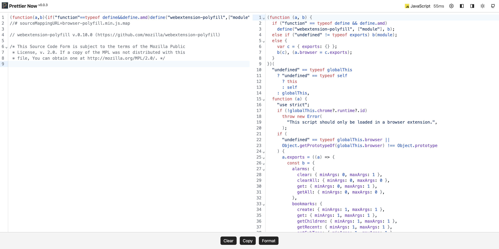
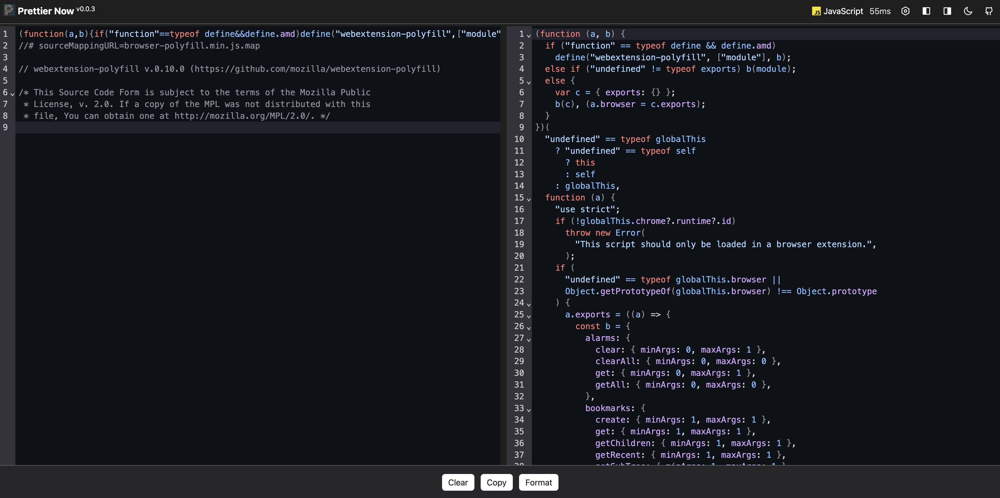

# prettier-now

> :hammer: Yet another [prettier](https://prettier.io) browser extension.

## Install

[link-chrome]: https://chromewebstore.google.com/detail/prettier-now/jdclalpfpcpojbhnkjebiepeeegmlhdf 'Version published on Chrome Web Store'
[link-firefox]: https://addons.mozilla.org/zh-CN/firefox/addon/prettier-now 'Version published to Mozilla Addons'

[][link-chrome] [][link-chrome] and other Chromium browsers

[][link-firefox] [][link-firefox]

## Features

- ✨ Format source code with customizable Prettier options
- 📥 Drag and drop files into the formatter
- 📁 Select one or more files to format
- 📋 Paste files directly into the workspace
- 🖱️ Open Prettier Now actions from browser context menus
- 🎯 Format the focused editor directly from the context menu or extension command
- ⚡ Open the options page from the popup, context menu, or `Alt+O`
- 🧩 Edit source and formatted output side by side with CodeMirror-powered editors
- 🧠 Select languages manually or infer them from file names and focused editor context
- 📦 Batch format multiple selected, dropped, or pasted files with a file job list
- 📤 Copy formatted output, download the current result, or download all formatted files
- 🔍 View line-by-line diffs between source and formatted result
- 🕘 Keep format history that can restore previous results
- 🧾 Inspect runtime logs for successful formats and formatter errors
- 💾 Save, apply, delete, import, export, and reset formatting option presets
- 🔧 Configure core Prettier options plus XML, PHP, Java, Svelte, and TOML plugin options
- 🎛️ Toggle source/result layouts, color mode, toast verbosity, debug logging, auto-format, and theme color
- 🌐 Localized UI for English, Simplified Chinese, Traditional Chinese, Japanese, and Korean

## Supported languages

### Built-in language plugins

- JavaScript
- TypeScript
- HTML
- Vue
- Angular
- CSS
- Less
- SCSS
- GraphQL
- JSON
- YAML
- Markdown

### Official language plugins

- XML (via [@prettier/plugin-xml](https://github.com/prettier/plugin-xml))
- PHP (via [@prettier/plugin-php](https://github.com/prettier/plugin-php))
- Pug (via [@prettier/plugin-pug](https://github.com/prettier/plugin-pug))

### Community language plugins

- Java (via [prettier-plugin-java](https://github.com/jhipster/prettier-java))
- Svelte (via [prettier-plugin-svelte](https://github.com/sveltejs/prettier-plugin-svelte))
- TOML (via [prettier-plugin-toml ](https://github.com/un-ts/prettier/tree/master/packages/toml))

## Screenshots

## Credits

- UI design from [AST Explorer](https://ast-explorer.dev/) created by [sxzz](https://github.com/sxzz)
- Built on top of [WXT](https://wxt.dev), the next-gen web extension framework

## License

[MIT](./LICENSE) License © 2024 to PRESENT [ntnyq](https://github.com/ntnyq)
